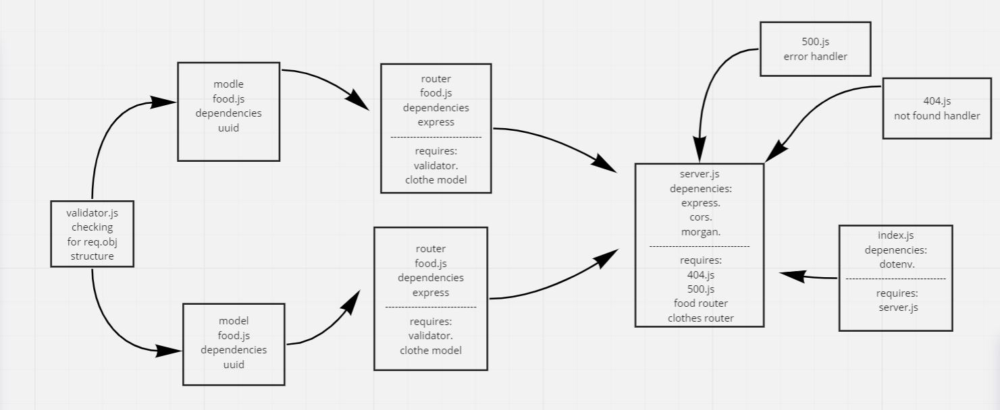

# basic-api-server
## heroku app link:  
[https://saeed-basic-api-server.herokuapp.com/](https://saeed-basic-api-server.herokuapp.com/)  
## pull request link:  
[https://github.com/awwadsaeed/basic-api-server/pull/1](https://github.com/awwadsaeed/basic-api-server/pull/1)  
## GitHub actions link:  
[https://github.com/awwadsaeed/basic-api-server/actions](https://github.com/awwadsaeed/basic-api-server/actions)
## describtion  
a basic api server that has a models and 5 requeste each to deomnstrate a crud app with rest methods and mimick a data base along with some middleware.
it integrated CI testing.  
## UML:  

